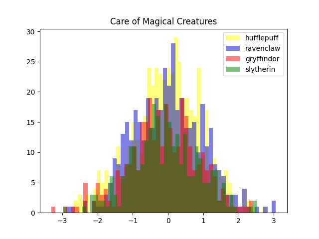
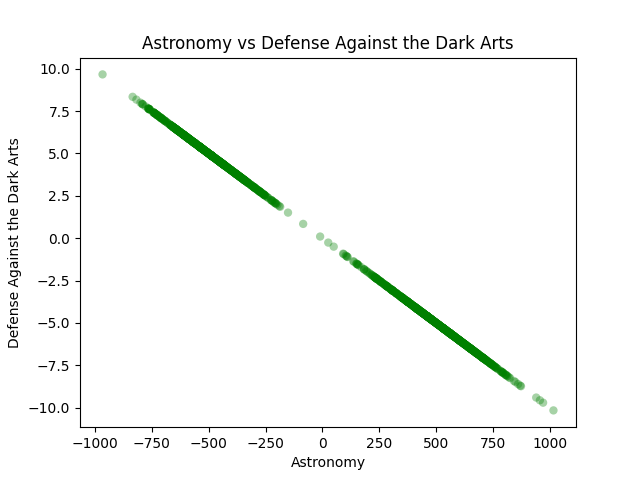
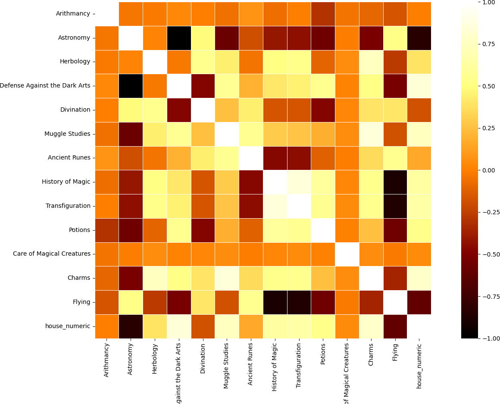
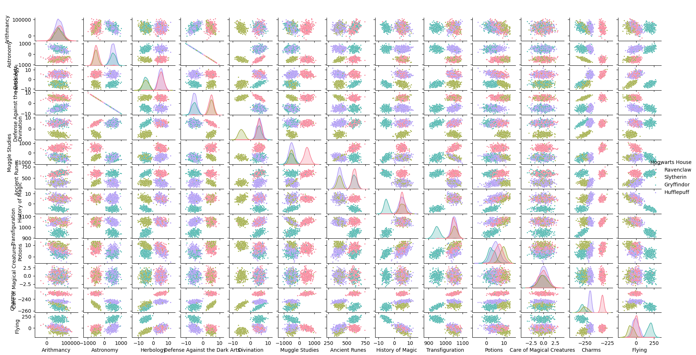

<div align="center">

# Data science X Logistic Regression

#### Harry Potter and a Data Scientist

</div>

- [The subject](#the-subject)
- [Requirements](#requirements)
- [Installation](#installation)
- [Usage](#usage)
- [Answers to subject questions](#answers-to-subject-questions)
- [Logistic regression one vs all](#logistic-regression-one-vs-all)
    - [What is Logistic Regression?](#what-is-logistic-regression)
    - [How does it work?](#how-does-it-work)
    - [One vs All Approach](#one-vs-all-approach)
- [Implementation](#implementation)
    - [Training Program `logreg_train.py`](#training-program-logreg_trainpy)
    - [Prediction Program `logreg_predict.py`](#prediction-program-logreg_predictpy)
- [Useful links](#useful-links)

### The subject

The goal of this project is to implement a logistic regression model from scratch to predict the Hogwarts house of a
student based on their grades in different disciplines. The dataset contains information about students' scores in
various disciplines and their corresponding Hogwarts houses.

## Requirements

* [numpy](https://numpy.org/install/)
* [pandas](https://pandas.pydata.org/docs/getting_started/install.html)
* [matplotlib](https://matplotlib.org/stable/install/index.html)
* [scikit-learn](https://scikit-learn.org/stable/install.html)
* [seaborn](https://seaborn.pydata.org/installing.html)

## Installation

```bash
git clone https://github.com/RhesusP/dslr.git
cd dslr
```

## Usage

A virtual environment is available in the project. You can use it to install the requirements.

```bash
source ./setup_env.sh
```

Once, the environment is activated, you can first train the model using the given training dataset:

```bash
python3 logreg_train.py datasets/dataset_train.csv
```

Then, you can use the model to predict the house of a student using the test dataset:

```bash
python3 logreg_predict.py datasets/dataset_test.csv
```

## Answers to subject questions

### 1. **Which Hogwarts course has a homogeneous score distribution between all four houses?**

The course with a homogeneous score distribution between all four houses is **Care of Magical Creatures**. The
distribution of scores for this course is similar for all four houses. This indicates that students from different
houses perform similarly in this subject (so this course is not a good predictor of the house).



### 2. **What are the two features that are similar ?**

The two features that are similar are **Astronomy** and **Defense Against the Dark Arts**. This can be observed in the
following scatter plot which shows the scores of students in these two subjects. We can observe a pretty diagonal line
indicating a strong negative correlation between the two features.



This observation is confirmed when we print the correlation matrix of the dataset. We can see that the correlation
between these two features is near -1.



If we look at the values of these two features, we can see that there is a factor of -100 between the two features,
explaining the strong negative correlation.

### 3. **From this visualization, what features are you going to use for your logistic regression?**

The features that are going to be used for the logistic regression are:

- Astronomy
- Herbology
- Divination
- Ancient Runes
- Muggle Studies
- History of Magic
- Transfiguration
- Charms

Thanks to the pair plot, we can see that these features are well separated between the four houses.



## Logistic regression _one vs all_

### What is Logistic Regression?

Logistic Regression is used for binary classification. Unlike linear regression (which predicts continuous values),
logistic regression estimates the probability that an input belongs to a particular class. The output is a value between
0 and 1, which can be interpreted as a probability.

At the heart of logistic regression is the sigmoid function, defined as:

$$
\sigma(x) = \frac{1}{1 + e^{-x}}
$$

This function takes any real number and maps it to a value between 0 and 1. The output can be interpreted as a
probability

### How does it work?

#### 1. The model computes a linear combination of the features:

$$
z = \theta_0 + \theta_1 x_1 + \theta_2 x_2 + ... + \theta_n x_n
$$

where:

- $\theta_0$ is the intercept (bias term)
- $\theta$ are the weights (parameters) of the model
- $x$ are the features

#### 2. Applying the sigmoid function

The output of the linear combination is passed through the **sigmoid function** to obtain a probability:

$$
h_\theta(x) = \sigma(z) = \frac{1}{1 + e^{-z}}
$$

#### 3. Compute the cost

The model uses a cost function called the **cross-entropy cost function** to measure the difference between the
predicted probabilities and the actual labels. The cost function is defined as:

$$
J(\theta) = -\frac{1}{m} \sum_{i=1}^{m} \left[ y^{(i)} \log(h_\theta(x^{(i)})) + (1 - y^{(i)}) \log(1 - h_\theta(x^{(i)})) \right]
$$

where:

- $m$ is the number of training examples
- $y^{(i)}$ is the actual label for the $i$-th training example
- $h_\theta(x^{(i)})$ is the predicted probability for the $i$-th training example

Like linear regression, logistic regression computes weights for each feature, compute a cost try to minimize that cost.
The cost function is defined as:

$$
J(\theta) = -\frac{1}{m} \sum_{i=1}^{m} \left[ y^{(i)} \log(h_\theta(x^{(i)})) + (1 - y^{(i)}) \log(1 - h_\theta(x^{(i)})) \right]
$$

#### 4. Optimization with Gradient Descent

**Gradient Descent** algorithm is used to find the best weights that minimize the cost function.

### One vs All

In this case, we have multiple classes (4 Hogwarts houses). We can use the one-vs-all approach to train a separate
logistic regression model for each class.

1. First, we train one logistic regression model for each class. For a given house, say Gryffindor, the corresponding
   classifier is trained to distinguish between Gryffindor (labeled as 1) and all other houses (labeled as 0).
2. When a new example is presented, each classifier estimates the probability that the example belongs to its class. The
   final prediction is simply the class whose classifier gives the highest probability.

## Implementation

### Training Program `logreg_train.py`

1. Load the training dataset
2. Preprocess the data (split it into training and validation sets, replace nan values and standardization)
3. Converts the Hogwarts houses into numeric values (0, 1, 2, 3)
4. Train a logistic regression model for each house using the one-vs-all approach
5. Save optimized weights for each house in `.weights.csv` file
6. Compute the accuracy of the model using `accuracy_score` from `sklearn.metrics`

### Prediction Program `logreg_predict.py`

1. Load the test dataset and the weights file
2. Preprocess the data (replace nan values and standardization)
3. Use the weights to predict the house for each student
4. Save the predictions in a `houses.csv` file

## Useful links

- [Logistic Regression - Wikipedia](https://en.wikipedia.org/wiki/Logistic_regression)
- [Sigmoid function - Wikipedia](https://en.wikipedia.org/wiki/Sigmoid_function)
- [AI for you - Morgan Gautherot - Implémenter la regression logistique from scratch](https://www.youtube.com/watch?v=r1iybVbTBZQ)
- [Régression logistique : les bases | Réseaux de neurones 9](https://www.youtube.com/watch?v=pOsqQ0MAHrY)
